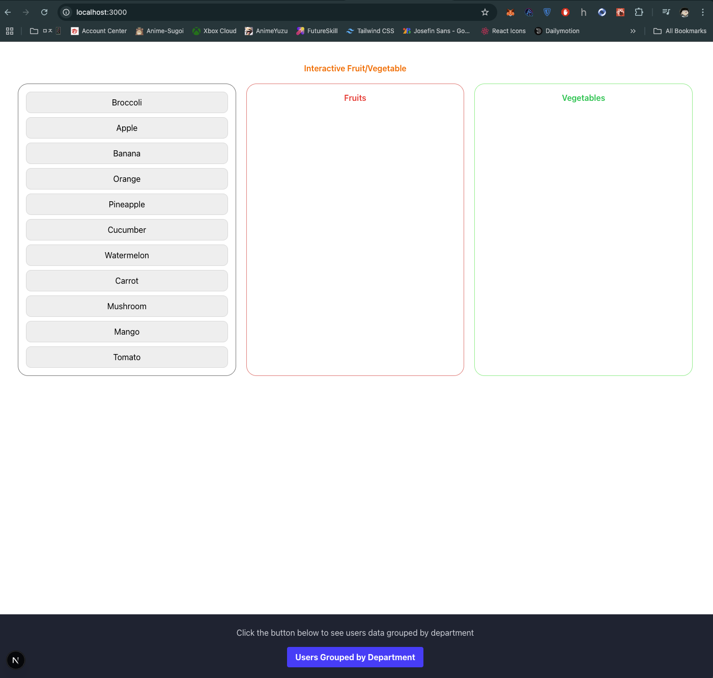
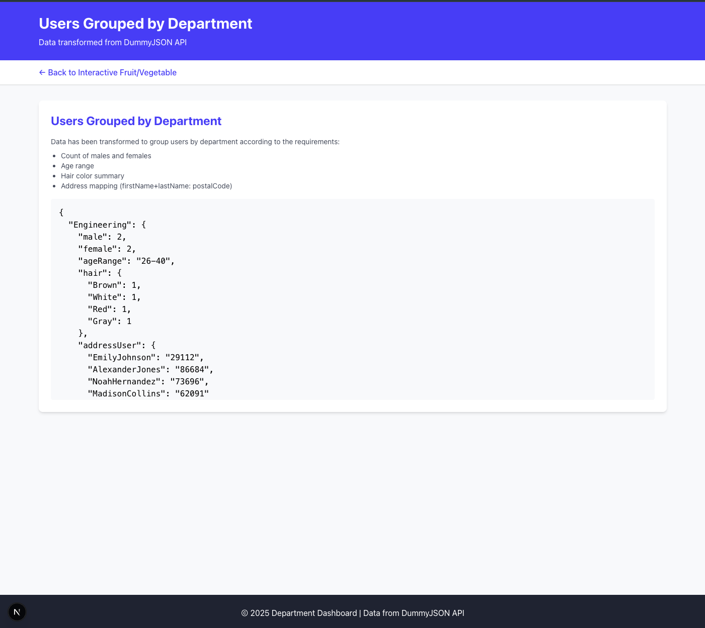

This is a [Next.js](https://nextjs.org) project bootstrapped with [`create-next-app`](https://github.com/vercel/next.js/tree/canary/packages/create-next-app).

## Getting Started  >> https://frontend-test-phi-gray.vercel.app

1. Auto Delete Todo List

  
  

2. Tranforms JSON data from API to new data groupBy department

  
  

# frontend-test
